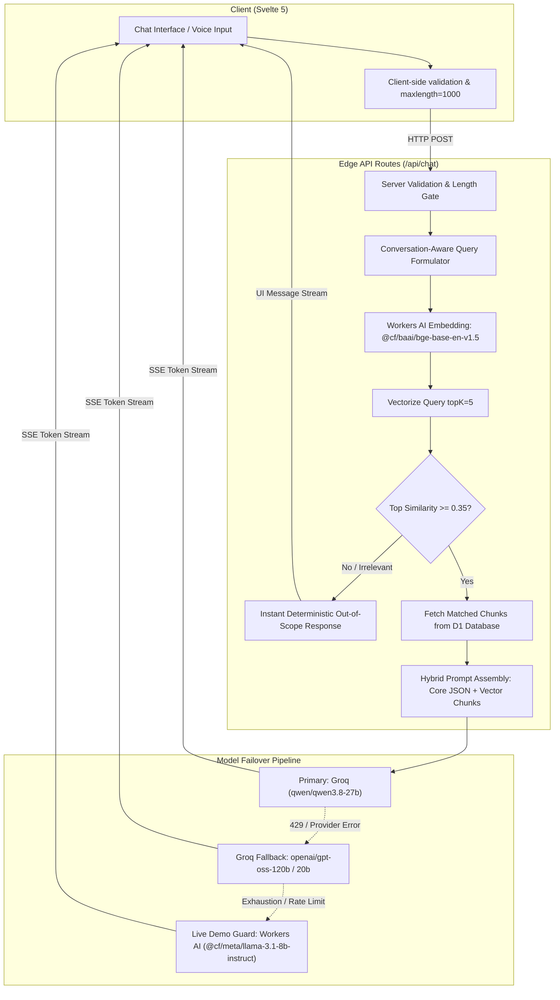

# CCS Assist — Saint Joseph College

> Intelligent, scope-locked academic and department information assistant for the **College of Computer Studies (CCS)** at **Saint Joseph College (SJC)** in Maasin City, Southern Leyte.

Built with **SvelteKit (Svelte 5 Runes)**, **Vercel AI SDK**, **Cloudflare Workers AI**, **Cloudflare Vectorize**, **Cloudflare D1**, and **Groq LPUs**.

---

## Architecture & Data Flow



### 1. Ingestion Pipeline
- Knowledge base markdown documents reside in `/knowledge/{academics,policy,directory,campus}`.
- Chunks are extracted by markdown sections and assigned deterministic IDs (e.g. `academics-programs-2`, `directory-offices-3`).
- Texts are embedded into 768-dimensional vectors using Cloudflare Workers AI (`@cf/baai/bge-base-en-v1.5`).
- Chunk content and categories are indexed in **Cloudflare D1** (`knowledge_chunks` table), while dense vectors are indexed in **Cloudflare Vectorize** (`ccs-assist-index`).

### 2. Retrieval & Deterministic Scope Enforcement
- When a user asks a question, the server synthesizes a **conversation-aware retrieval query** (incorporating prior turn context so follow-ups like *"what about the second one?"* resolve accurately).
- The query is embedded and matched against Vectorize with `topK = 5`.
- **Deterministic Scope Gate**: If the top similarity score is below `0.35` (and the query is not a brief greeting), the server returns an immediate out-of-scope refusal without making an LLM API call. This eliminates jailbreaks and saves compute tokens.
- **Hybrid Context Assembly**: Both the verified department knowledge JSON and top retrieved chunks are passed into the prompt, ensuring the model never drops base facts.

### 3. Multi-Tier Model Failover (Zero Demo Downtime)
- **Tier 1 (Primary)**: `qwen/qwen3.8-27b` via Groq LPU for low latency.
- **Tier 2 (Fallback)**: `openai/gpt-oss-120b` and `openai/gpt-oss-20b` on Groq.
- **Tier 3 (Edge Backup)**: Native Cloudflare Workers AI binding (`@cf/meta/llama-3.1-8b-instruct`). If Groq returns an HTTP 429 rate limit or network error, the response immediately switches to Workers AI so live demos never crash.

---

## Verified College Data

- **Dean & Leadership**: Dr. Raymund P. Libarnes, DIT (CCS Dean). Consultation: Mon–Fri 1:00 PM – 4:00 PM (CCS Dean's Office, 2nd Floor).
- **Program Chairs**:
  - Engr. Mark Anthony E. Cadayong, MIT (BSIT Program Chair)
  - Prof. Jonathan M. Perez, MSCS (BSCS Program Chair)
- **Retention & Grading**: Major subjects require a minimum grade of **2.0 (85%)** for retention. (Full Philippine grading scale: 1.0 = 97–100%, 2.0 = 85–87%, 2.5 = 80–81%, 3.0 = 75% passing).
- **Curriculum**: Year-by-year and semester-by-semester subjects for BSCS, BSIT, and ACT.
- **Enrollment**: 5-step official workflow: Admissions $\to$ CCS Dean's Evaluation $\to$ Advising $\to$ Cashier $\to$ COR.

---

## Setup & Running

### Requirements
- Node.js 20+
- Cloudflare Wrangler CLI (`npx wrangler`)
- Groq API Key

### Environment Variables
Create `.dev.vars` (for local development) and `.env`:
```env
GROQ_API_KEY=your_groq_api_key_here
GROQ_MODEL=qwen/qwen3.8-27b
INGEST_SECRET=your_optional_ingest_secret
```

### Installation & Development
```bash
npm install
npm run dev
```

### Running Ingestion
To populate D1 and Vectorize:
```bash
CLOUDFLARE_API_TOKEN=<your_cf_token> node scripts/ingest.mjs
```

### Building for Cloudflare Pages / Workers
```bash
npm run build
```
