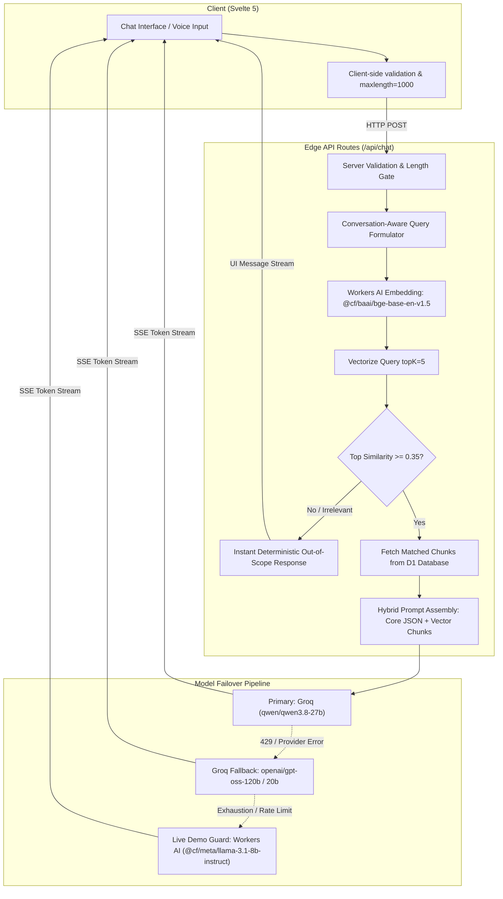

# CCS Assist — Saint Joseph College

> Intelligent, scope-locked academic and department information assistant for the **College of Computer Studies (CCS)** at **Saint Joseph College (SJC)** in Maasin City, Southern Leyte.

Built with **SvelteKit (Svelte 5 Runes)**, **Vercel AI SDK**, **Cloudflare Workers AI**, **Cloudflare Vectorize**, **Cloudflare D1**, and **Groq LPUs**.

---

## Architecture & Data Flow



### 1. Ingestion Pipeline
- Knowledge base markdown documents reside in `/knowledge/{academics,policy,directory,campus}`.
- Chunks are extracted by markdown sections and assigned deterministic IDs (e.g. `academics-programs-2`, `directory-offices-3`).
- Texts are embedded into 768-dimensional vectors using Cloudflare Workers AI (`@cf/baai/bge-base-en-v1.5`).
- Chunk content and categories are indexed in **Cloudflare D1** (`knowledge_chunks` table), while dense vectors are indexed in **Cloudflare Vectorize** (`ccs-assist-index`).

### 2. Retrieval & Deterministic Scope Enforcement
- When a user asks a question, the server synthesizes a **conversation-aware retrieval query** (incorporating prior turn context so follow-ups like *"what about the second one?"* resolve accurately).
- The query is embedded and matched against Vectorize with `topK = 5`.
- **Deterministic Scope Gate**: If the top similarity score is below `0.35` (and the query is not a brief greeting), the server returns an immediate out-of-scope refusal without making an LLM API call. This eliminates jailbreaks and saves compute tokens.
- **Hybrid Context Assembly**: Both the verified department knowledge JSON and top retrieved chunks are passed into the prompt, ensuring the model never drops base facts.

### 3. Multi-Tier Model Failover (Zero Demo Downtime)
- **Tier 1 (Primary)**: `qwen/qwen3.8-27b` via Groq LPU for low latency.
- **Tier 2 (Fallback)**: `openai/gpt-oss-120b` and `openai/gpt-oss-20b` on Groq.
- **Tier 3 (Edge Backup)**: Native Cloudflare Workers AI binding (`@cf/meta/llama-3.1-8b-instruct`). If Groq returns an HTTP 429 rate limit or network error, the response immediately switches to Workers AI so live demos never crash.

---

## Verified College Data

- **Dean & Leadership**: Haidee Galdo (formerly Riza Siega), CCS Dean. Office: Main Campus, 1st Floor, right side near the entrance, beside the staircase. Hours: Monday–Friday, 8:00 AM – 5:00 PM.
- **Institutional Leadership**: Rev. Msgr. Oscar A. Cadayona, PhD, SThL-MA (School President).
- **Academic Programs**:
  - Bachelor of Science in Information Technology (BSIT) — 4 Years (Business & Data Analytics track)
  - Bachelor of Science in Computer Science (BSCS) — 4 Years
  - Associate in Computer Technology (ACT) — 2 Years (Ladderized into BSIT/BSCS)
- **Retention & Academic Policies**:
  - **3rd Year Retention Threshold**: To qualify for admission to the 3rd year in BSIT and BSCS, students must complete all 1st and 2nd year professional courses with an average rating of at least **2.25 (83–85%)**. This average rating must be maintained.
  - **Failing Limit**: A student who fails in more than three (3) subjects is advised to shift to another program.
  - **CAT Screening**: Passing rate of at least 75% on the College Admission Test (CAT) for direct entry into BSIT/BSCS. Applicants with CAT scores below 75% enroll in the 2-Year ACT program and can shift to BSIT/BSCS after the 1st semester with a 2.25 GPA.
  - **Grading Scale**: 1.00 = 98–100% (Excellent), 1.25 = 95–97%, 1.50 = 92–94%, 1.75 = 89–91%, 2.00 = 86–88% (Dean's Lister), 2.25 = 83–85% (3rd Year Retention Threshold), 2.50 = 80–82%, 2.75 = 77–79%, 3.00 = 75–76% (Passing), 5.00 = Below 75% (Failed).
- **Curriculum & Prerequisites**: Complete year-by-year subject breakdown for BSIT, BSCS, and ACT. 24 units of Theology required for graduation; completion of PATHFit 1–4 and NSTP 11–12 required for 4th year standing.
- **Enrollment**: 5-step official workflow: Admissions & CAT Screening $\to$ CCS Academic Evaluation (Dean's Office, 1st Floor) $\to$ Subject Advising & Portal Encoding $\to$ Fee Assessment & Settlement (Finance/Bursar) $\to$ Official Registration (COR) & ID Validation.

---

## Setup & Running

### Requirements
- Node.js 20+
- Cloudflare Wrangler CLI (`npx wrangler`)
- Groq API Key

### Environment Variables
Create `.dev.vars` (for local development) and `.env`:
```env
GROQ_API_KEY=your_groq_api_key_here
GROQ_MODEL=qwen/qwen3.8-27b
INGEST_SECRET=your_optional_ingest_secret
```

### Installation & Development
```bash
npm install
npm run dev
```

### Running Ingestion
To populate D1 and Vectorize:
```bash
CLOUDFLARE_API_TOKEN=<your_cf_token> node scripts/ingest.mjs
```

### Building for Cloudflare Pages / Workers
```bash
npm run build
```
